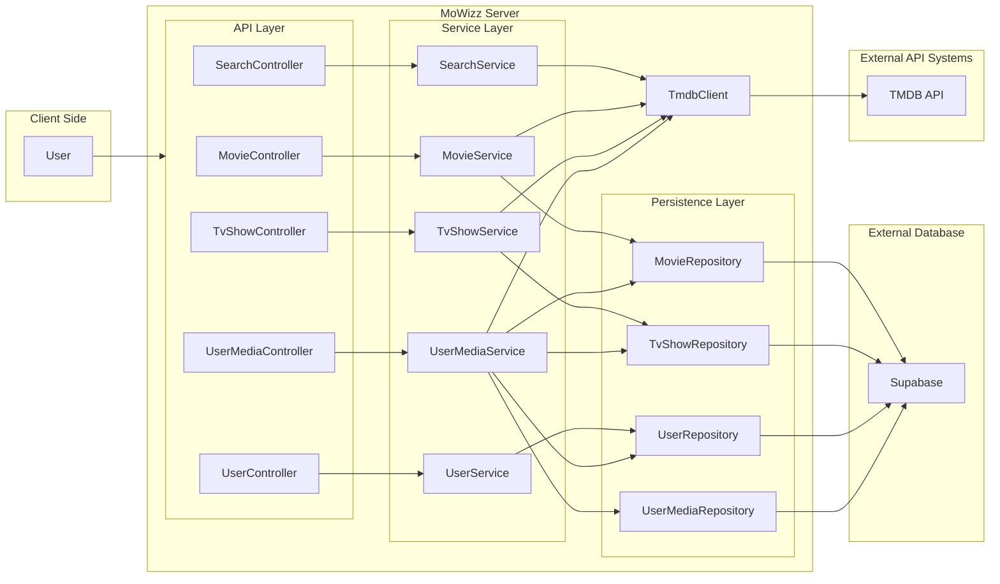

# MoWizz Server

MoWizz Server is a Spring Boot backend for movie and TV discovery using the TMDB API, with PostgreSQL persistence for user data.

## Overview

This service provides:
- TMDB-backed movie discovery endpoints
- TMDB-backed TV show discovery endpoints
- Multi-search via TMDB
- Basic user management endpoints

## System Architecture



## Tech Stack

- Java 21
- Spring Boot 4.0.1
- Spring Web MVC
- Spring Data JPA
- Flyway
- PostgreSQL
- Maven Wrapper (`./mvnw`)

## Prerequisites

- Java 21+
- PostgreSQL instance
- TMDB API access token

## Configuration

Create a `.env` file in the project root (or export variables directly):

```bash
export DB_URL=your_db_url
export DB_USERNAME=your_username
export DB_PASSWORD=your_password
export TMDB_ACCESS_TOKEN=your_tmdb_access_token
```

Reference template: `.env.example`

## Running Locally

```bash
./mvnw spring-boot:run
```

Server URL:

```text
http://localhost:8080
```

Flyway migrations run on startup, and Hibernate is configured with `ddl-auto=validate`.

## Build and Test

```bash
./mvnw clean verify
```

## API Endpoints

### Movies (`/movies`)
- `GET /movies/search?query=...`
- `GET /movies/{tmdbId}`
- `GET /movies/popular`
- `GET /movies/top-rated`
- `GET /movies/upcoming`

### TV Shows (`/shows`)
- `GET /shows/{tmdbId}`
- `GET /shows/popular`
- `GET /shows/top-rated`

### Search (`/search`)
- `GET /search/multi?query=...`

### Users (`/users`)
- `POST /users`
- `GET /users`
- `GET /users/{id}`
- `DELETE /users/{id}`

### User Media
- `POST /users/{user_id}/movie` (body: TMDB movie id as a JSON number)
- `POST /users/{user_id}/tvshow` (body: TMDB TV show id as a JSON number)

## OpenAPI

The canonical API contract lives in `openapi.yaml`.

Use one of the following:
- Import `openapi.yaml` into Swagger UI, Postman, or Insomnia.
- Serve it in Swagger UI locally with your preferred OpenAPI viewer.

## License

This project is licensed under the MIT License. See [LICENSE](LICENSE) for details.
